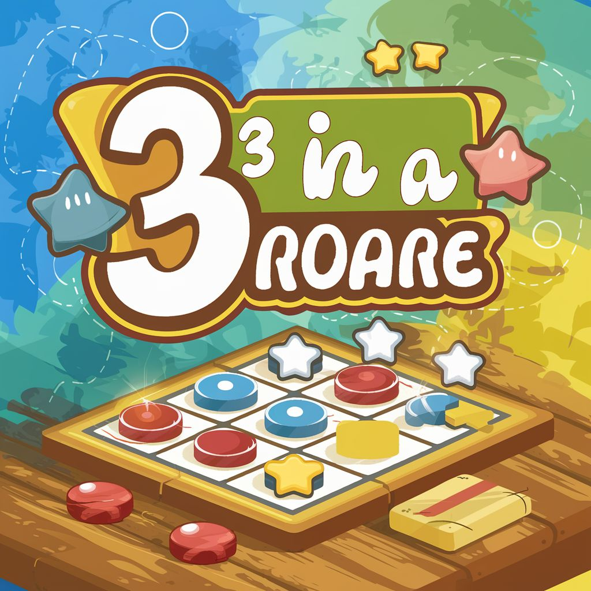

#  Tres en Raya  

Este proyecto es una implementación simple del juego "Tres en Raya" (Tic Tac Toe) usando React.

## Contenido

- [Descripción](#descripción)
- [Demo](#demo)
- [Instrucciones de Uso](#instrucciones-de-uso)
- [Estructura del Proyecto](#estructura-del-proyecto)
- [Licencia](#licencia)

## Descripción

Este proyecto consiste en un juego de "Tres en Raya" en el cual dos jugadores se turnan para marcar casillas en un tablero de 3x3. El juego sigue las reglas estándar del "Tres en Raya", donde el objetivo es lograr tener tres fichas del mismo tipo en línea, ya sea horizontal, vertical o diagonalmente.

## Demo

Este es un demo [3 en raya](https://juego-3-en-raya-ten.vercel.app/), dos jugadores se turnan para marcar casillas en un tablero de 3x3. El objetivo es lograr tener tres fichas del mismo tipo en línea, ya sea horizontal, vertical o diagonalmente.

¡Diviértete jugando!

## Instrucciones de Uso

1. Clona este repositorio `https://github.com/Cristian0813/3-en-raya.git` en tu máquina local.
2. Asegúrate de tener Node.js y npm instalados en tu sistema.
3. Navega hasta la carpeta del proyecto y ejecuta `npm install` para instalar las dependencias.
4. Una vez instaladas las dependencias, ejecuta `npm start` para iniciar la aplicación en modo de desarrollo.
5. Abre tu navegador y navega a `http://localhost:3000` para jugar al "Tres en Raya".

## Estructura del Proyecto

El proyecto está organizado de la siguiente manera:

- **App.jsx:** Este archivo contiene el componente principal de la aplicación. Es responsable de manejar el estado del tablero, los turnos de los jugadores y la lógica del juego.
- **constants.js:** Aquí se definen las constantes utilizadas en el juego, como los símbolos de los jugadores y las combinaciones ganadoras.
- **components/:** Esta carpeta contiene los componentes de React utilizados en la interfaz de usuario, como el componente de casilla (`Square.jsx`) y el modal de ganador (`WinnerModal.jsx`).
- **logic/:** En esta carpeta se encuentran los archivos que contienen la lógica del juego, como la verificación de ganadores y el almacenamiento en el navegador.
- **logic/storage/index.js:** Aquí se implementa la funcionalidad para guardar y restablecer el estado del juego utilizando el almacenamiento local del navegador.

## Licencia

Este tutorial está bajo la licencia [MIT](https://github.com/Cristian0813/3-en-raya/blob/main/LICENSE). Puedes usarlo y modificarlo libremente.
